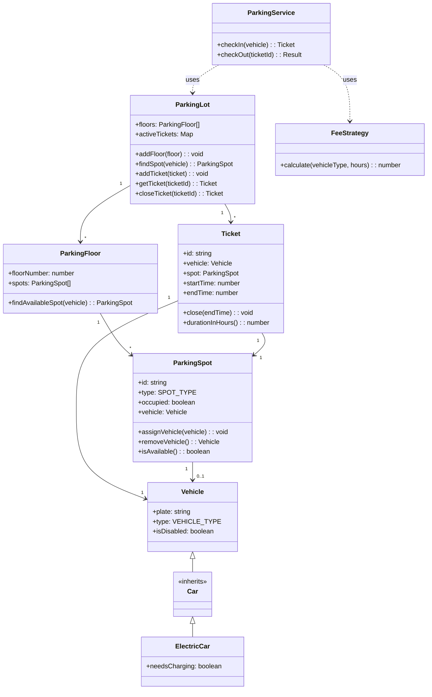
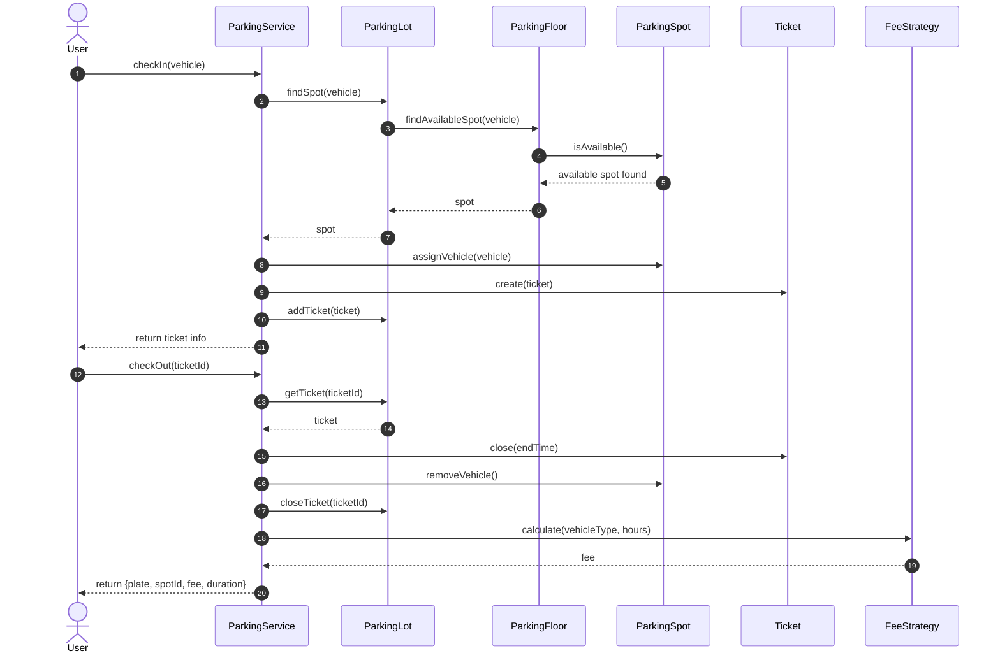
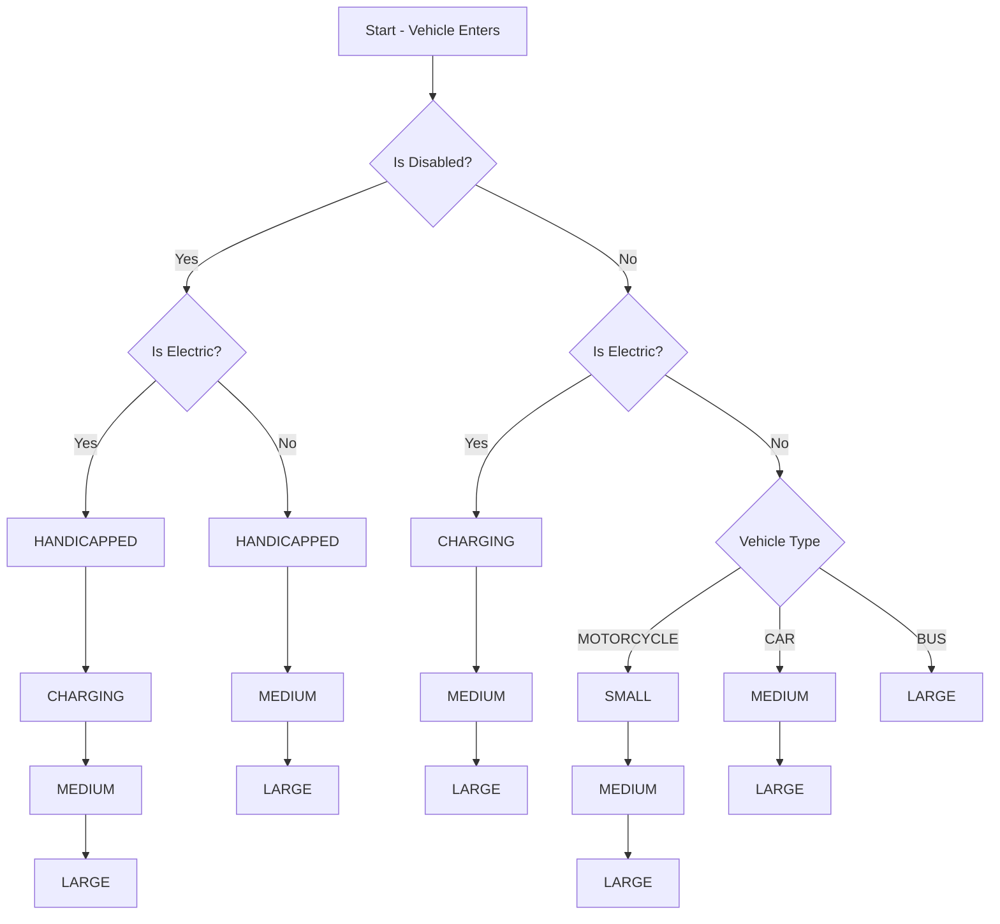

# Smart Parking Lot System

A modular, object-oriented backend system simulating a **multi-floor smart parking lot**. Built in **JavaScript (Node.js)** with extensible design patterns and support for vehicle types like **electric cars**, **disabled drivers**, and dynamic **parking fee calculation**.


## Features

✅ Automatic parking spot allocation  
✅ Multi-floor support  
✅ Entry/Exit tracking via tickets  
✅ Fee calculation based on duration and vehicle type  
✅ Electric vehicle charging support  
✅ Accessible parking for disabled drivers  
✅ Built with SOLID principles and OOP  
✅ Designed for easy API/DB integration


## Tech Stack

- **Node.js** (no frameworks)
- **JavaScript OOP** using ES6 classes
- **Design Patterns**: Singleton, Strategy, Factory, Inheritance
- **In-Memory Simulation** (can be extended to use DB like MongoDB/Postgres)

## Core Concepts Used

| Concept               | Implementation                                                                 |
|------------------------|---------------------------------------------------------------------------------|
| Object-Oriented Design | Vehicle inheritance (`ElectricCar → Car → Vehicle`), encapsulation of logic    |
| SOLID Principles       | Each class has a single responsibility, is easily extensible and testable      |
| Strategy Pattern       | Used for fee calculation logic                                                  |
| Singleton Pattern      | Only one instance of `ParkingLot` (shared globally)                            |
| Enum Constants         | Centralized control of types and rates via `constants/enums.js`                |

##  UML Class Diagram



## Sequence Diagram



## Spot Type Preference



## Project Structure

```tree
parking-lot-lld/
├── constants/
│   └── enums.js                # Enums for vehicle types, spot types, and fees
├── models/
│   ├── vehicles/
│   │   ├── Vehicle.js
│   │   ├── Car.js
│   │   └── ElectricCar.js
│   ├── ParkingFloor.js        # Contains logic to allocate spot based on type
│   ├── ParkingLot.js          # Singleton class managing the full lot state
│   ├── ParkingSpot.js         # ParkingSpot with type and occupancy info
│   └── Ticket.js              # Tracks vehicle check-in/check-out
├── services/
│   ├── FeeStrategy.js         # Calculates fees based on vehicle type and duration
│   └── ParkingService.js      # Core service to check in/out vehicles
├── utils/
│   └── IDGenerator.js         # Generates unique IDs for tickets
├── index.js                   # Entry point for demo/testing
└── README.md

```


## Vehicle Types

- `MOTORCYCLE`
- `CAR`
- `BUS`
- `ELECTRIC` (inherits from `Car`)
  - Can request **charging** spot
  - Charged at a different fee rate
- `isDisabled: true` flag available for any vehicle
  - Prioritizes **HANDICAPPED** spots


## 🅿️ Parking Spot Types

- `SMALL` – for motorcycles
- `MEDIUM` – for cars
- `LARGE` – for cars & buses
- `CHARGING` – for electric vehicles
- `HANDICAPPED` – for disabled users


## Fee Strategy

Fees are calculated per hour:

| Vehicle Type | Hourly Rate |
|--------------|-------------|
| MOTORCYCLE   | ₹10         |
| CAR          | ₹20         |
| ELECTRIC     | ₹25         |
| BUS          | ₹30         |

*Time is rounded up to the nearest hour.*

## How It Works

1. **Start the simulation:**
   - `node index.js`

2. **Demo Logic:**
   - Adds a parking floor with 5 spot types
   - Adds a disabled `Car` and an `ElectricCar`
   - Allocates preferred spots (`HANDICAPPED`, `CHARGING`)
   - Waits 2 seconds
   - Checks out both vehicles
   - Displays fee, duration, and plate info

## Example Output

```

✅ Disabled Car checked in. Spot: H1, Ticket: T-1
⚡ Electric Car checked in. Spot: C1, Ticket: T-2
🅿️ Disabled Car checked out. Fee: ₹20, Duration: 1hr
🔌 Electric Car checked out. Fee: ₹25, Duration: 1hr

````


## Run the Project

```bash
node index.js
````

## Test Scenarios

You can modify `index.js` to test:

* Full occupancy edge cases
* Only CHARGING spots left
* No HANDICAPPED spots left
* Mixed vehicle types
* Multiple floors

## Future Scopes

| Feature                    | How to Add                                                         |
| -------------------------- | ------------------------------------------------------------------ |
| REST API                   | Add Express and convert services to route handlers                 |
| Real DB (MongoDB/Postgres) | Replace in-memory data with persistent models                      |
| Real-time Dashboard        | Add WebSocket + charting for spot usage and availability           |
| Ticket Validation / QR     | Add Ticket code mapping or encryption                              |
| Concurrency Locking        | Use Redis or mutex for spot-level locks in high-throughput systems |

---


