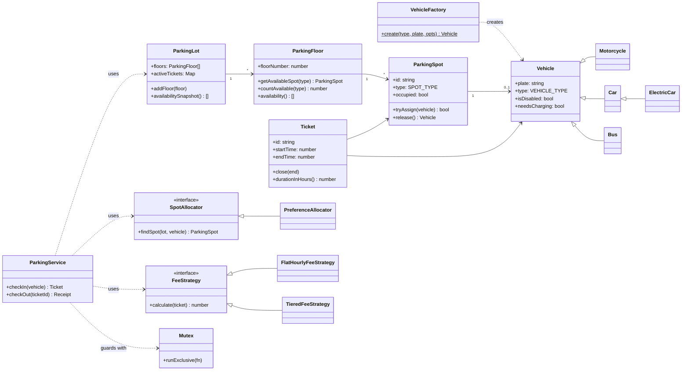
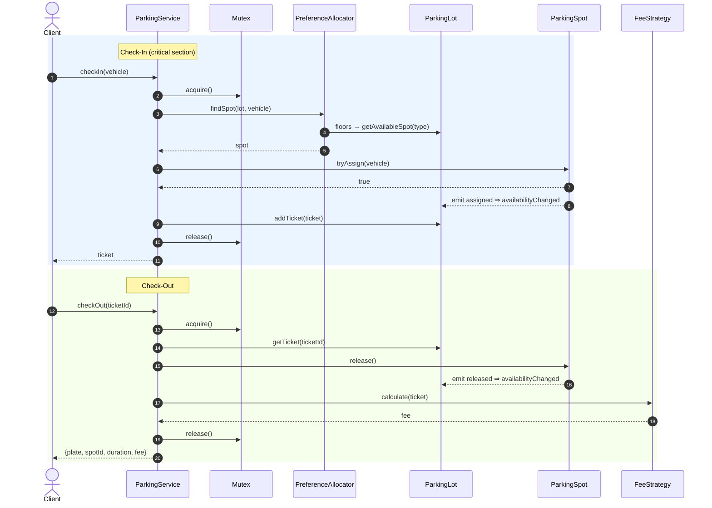
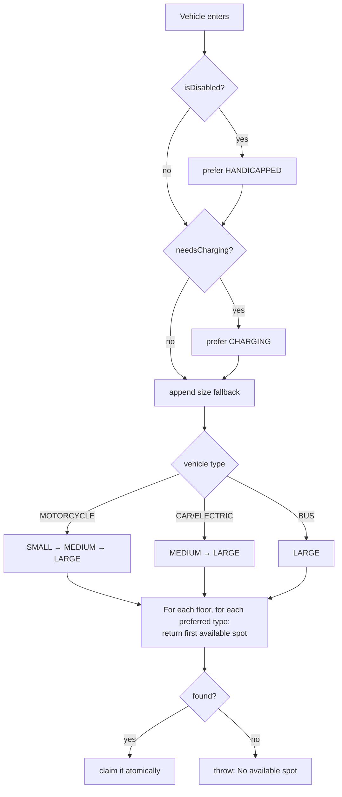

# 🅿️ Smart Parking Lot System — Low-Level Design

A backend **low-level design** for a multi-floor smart parking lot, built as
small, single-purpose classes in **plain Node.js** (ES6 classes, no runtime
dependencies). It picks a spot based on the vehicle's size and any special
needs, tracks each stay with a ticket, works out the fee on the way out, and
reports free spaces as they change — and it handles cars arriving and leaving at
the same time.

> This is a design/LLD exercise, so everything lives **in memory**: there's no
> REST API and no database. The pieces are kept separate (repositories,
> strategies, services) so you could add those later without rewriting what's
> here.

---

## Table of Contents

- [Features](#features)
- [Tech Stack](#tech-stack)
- [Architecture Overview](#architecture-overview)
- [Class Diagram](#class-diagram)
- [Check-In / Check-Out Sequence](#check-in--check-out-sequence)
- [Spot Allocation Algorithm](#spot-allocation-algorithm)
- [Design Patterns](#design-patterns)
- [Concurrency Model](#concurrency-model)
- [Fee Calculation](#fee-calculation)
- [Real-Time Availability](#real-time-availability)
- [Domain Model](#domain-model)
- [Project Structure](#project-structure)
- [Running the Demo](#running-the-demo)
- [Running the Tests](#running-the-tests)
- [Assumptions](#assumptions)
- [Possible Extensions](#possible-extensions)
- [Known Limitations](#known-limitations)

---

## Features

| ✓ | Requirement (from brief) | How it's met |
|---|--------------------------|--------------|
| ✅ | **Automatic spot allocation by size** | `PreferenceAllocator` picks the smallest fitting spot, honouring HANDICAPPED / CHARGING needs first |
| ✅ | **Check-in / check-out tracking** | `ParkingService` issues a `Ticket` with entry time and closes it on exit |
| ✅ | **Fee calculation by duration & type** | Pluggable `FeeStrategy` (flat-hourly by default, tiered alternative provided) |
| ✅ | **Real-time availability** | `ParkingLot` is an `EventEmitter` that pushes `availabilityChanged` on every assign/release |
| ✅ | **Concurrency handling** | Per-service `Mutex` + atomic `ParkingSpot.tryAssign` prevent double-booking |

---

## Tech Stack

- **Node.js** (v18+), no frameworks, **no third-party dependencies**
- **ES6 classes**, CommonJS modules
- **Built-in `node:test`** runner for the test suite
- **`events.EventEmitter`** (Node core) for the observer/real-time layer

---

## Architecture Overview

The code is split into layers so each part has one job and talks to the others
through a small, well-defined interface:

```
            ┌──────────────────────────────────────────────┐
 index.js → │  Composition Root (builds & injects deps)    │
            └──────────────────────────────────────────────┘
                              │
                              ▼
                  ┌───────────────────────┐
                  │     ParkingService    │  check-in / check-out, Mutex-guarded
                  └───────────────────────┘
                    │          │          │
        allocator   │          │ fee      │  models
        ┌───────────▼──┐  ┌────▼───────┐  ▼
        │ SpotAllocator│  │ FeeStrategy│  ParkingLot ─▶ ParkingFloor ─▶ ParkingSpot
        │ (Strategy)   │  │ (Strategy) │       │ (EventEmitter)         (emits events)
        └──────────────┘  └────────────┘     Ticket, Vehicle (+Factory)
```

- **Models** (`ParkingLot`, `ParkingFloor`, `ParkingSpot`, `Ticket`, `Vehicle`)
  hold the data and emit events — they don't contain any business rules.
- **Strategies** (`SpotAllocator`, `FeeStrategy`) hold the business rules you
  might want to swap out.
- **Service** (`ParkingService`) runs a single use case end to end and looks
  after the locking.
- **Composition root** (`index.js`) builds everything and hands each piece its
  dependencies — nothing is a shared module-level singleton.

---

## Class Diagram


```mermaid
classDiagram
    direction LR

    class Vehicle {
      +plate: string
      +type: VEHICLE_TYPE
      +isDisabled: bool
      +needsCharging: bool
    }
    class Motorcycle
    class Car
    class ElectricCar
    class Bus
    class VehicleFactory {
      +create(type, plate, opts)$ Vehicle
    }
    Vehicle <|-- Motorcycle
    Vehicle <|-- Car
    Car <|-- ElectricCar
    Vehicle <|-- Bus
    VehicleFactory ..> Vehicle : creates

    class ParkingSpot {
      +id: string
      +type: SPOT_TYPE
      +occupied: bool
      +tryAssign(vehicle) bool
      +release() Vehicle
    }
    class ParkingFloor {
      +floorNumber: number
      +getAvailableSpot(type) ParkingSpot
      +countAvailable(type) number
      +availability() []
    }
    class ParkingLot {
      +floors: ParkingFloor[]
      +activeTickets: Map
      +addFloor(floor)
      +availabilitySnapshot() []
    }
    ParkingLot "1" --> "*" ParkingFloor
    ParkingFloor "1" --> "*" ParkingSpot
    ParkingSpot "1" --> "0..1" Vehicle

    class Ticket {
      +id: string
      +startTime: number
      +endTime: number
      +close(end)
      +durationInHours() number
    }
    Ticket --> Vehicle
    Ticket --> ParkingSpot

    class SpotAllocator {
      <<interface>>
      +findSpot(lot, vehicle) ParkingSpot
    }
    class PreferenceAllocator
    SpotAllocator <|-- PreferenceAllocator

    class FeeStrategy {
      <<interface>>
      +calculate(ticket) number
    }
    class FlatHourlyFeeStrategy
    class TieredFeeStrategy
    FeeStrategy <|-- FlatHourlyFeeStrategy
    FeeStrategy <|-- TieredFeeStrategy

    class ParkingService {
      +checkIn(vehicle) Ticket
      +checkOut(ticketId) Receipt
    }
    ParkingService ..> ParkingLot : uses
    ParkingService ..> SpotAllocator : uses
    ParkingService ..> FeeStrategy : uses
    ParkingService ..> Mutex : guards with

    class Mutex {
      +runExclusive(fn)
    }
```

---

## Check-In / Check-Out Sequence


```mermaid
sequenceDiagram
    autonumber
    actor Client
    participant Svc as ParkingService
    participant Mx as Mutex
    participant Alloc as PreferenceAllocator
    participant Lot as ParkingLot
    participant Spot as ParkingSpot
    participant Fee as FeeStrategy

    rect rgb(235, 245, 255)
    note over Svc: Check-In (critical section)
    Client->>Svc: checkIn(vehicle)
    Svc->>Mx: acquire()
    Svc->>Alloc: findSpot(lot, vehicle)
    Alloc->>Lot: floors → getAvailableSpot(type)
    Alloc-->>Svc: spot
    Svc->>Spot: tryAssign(vehicle)
    Spot-->>Svc: true
    Spot-->>Lot: emit assigned ⇒ availabilityChanged
    Svc->>Lot: addTicket(ticket)
    Svc->>Mx: release()
    Svc-->>Client: ticket
    end

    rect rgb(245, 255, 235)
    note over Svc: Check-Out
    Client->>Svc: checkOut(ticketId)
    Svc->>Mx: acquire()
    Svc->>Lot: getTicket(ticketId)
    Svc->>Spot: release()
    Spot-->>Lot: emit released ⇒ availabilityChanged
    Svc->>Fee: calculate(ticket)
    Fee-->>Svc: fee
    Svc->>Mx: release()
    Svc-->>Client: {plate, spotId, duration, fee}
    end
```

---

## Spot Allocation Algorithm

First we build the list of spot types the vehicle prefers, then we walk the lot
floor by floor and take the first free spot that matches one of those types.


```mermaid
flowchart TD
    A[Vehicle enters] --> B{isDisabled?}
    B -- yes --> P1[prefer HANDICAPPED]
    B -- no --> C
    P1 --> C{needsCharging?}
    C -- yes --> P2[prefer CHARGING]
    C -- no --> D
    P2 --> D[append size fallback]

    D --> E{vehicle type}
    E -- MOTORCYCLE --> F1[SMALL → MEDIUM → LARGE]
    E -- CAR/ELECTRIC --> F2[MEDIUM → LARGE]
    E -- BUS --> F3[LARGE]

    F1 --> G
    F2 --> G
    F3 --> G[For each floor, for each preferred type:<br/>return first available spot]
    G --> H{found?}
    H -- yes --> I[claim it atomically]
    H -- no --> J[throw: No available spot]
```

**Why it's fast:** each `ParkingFloor` keeps a **free-list per spot type**
(`Map<SPOT_TYPE, Set<spot>>`) that spot events keep up to date, so finding a free
spot of a given type takes **constant time on average** instead of scanning the
whole floor.

---

## Design Patterns

| Pattern | Where | Why |
|---------|-------|-----|
| **Strategy** | `SpotAllocator` / `PreferenceAllocator`, `FeeStrategy` / `FlatHourly` & `Tiered` | Swap allocation or pricing rules without touching the service |
| **Factory** | `VehicleFactory` | Create any vehicle from a type string + options |
| **Observer** | `ParkingSpot`/`ParkingLot` via `EventEmitter` | Push real-time availability instead of polling |
| **Dependency Injection** | `ParkingService` constructor, wired in `index.js` | No global state; fully testable |
| **Inheritance / Encapsulation** | `Vehicle → Car → ElectricCar`, etc. | Model vehicle taxonomy and behaviour |

---

## Concurrency Model

Node runs JavaScript on a single thread, but checking in is a **"look, then
act"** sequence: find a free spot, then claim it. If that sequence ever pauses
partway through (it's synchronous today, but tomorrow it might `await` a
database), two callers could be handed the same spot. Two layers stop that from
happening:

1. **`Mutex` (one per service)** — `checkIn` and `checkOut` run inside
   `mutex.runExclusive(...)`, so only one of them is in the critical section at
   a time.
2. **`ParkingSpot.tryAssign` (atomic)** — checks whether the spot is taken and
   claims it in a single synchronous step, returning `true` or `false`. It's the
   safety net that makes double-booking impossible even without the lock.

The `concurrency.test.js` suite throws 10 check-ins at a single spot all at once
and checks that **exactly one** succeeds.

---

## Fee Calculation

Fees depend on **duration** and **vehicle type**. There's a **free grace window**
(15 minutes by default) so a driver who pulls in and leaves without really
parking pays nothing. Past that window, time is rounded **up** to the next hour,
with a **minimum 1-hour** charge.

| Vehicle Type | Hourly Rate |
|--------------|-------------|
| MOTORCYCLE   | ₹10 |
| CAR          | ₹20 |
| ELECTRIC     | ₹25 |
| BUS          | ₹30 |

Two strategies ship:

- **`FlatHourlyFeeStrategy`** (default): free within `graceMinutes`, otherwise
  `max(minHours, ceil(hours)) × rate`. Defaults: `graceMinutes: 15`, `minHours: 1`.
- **`TieredFeeStrategy`** (here to show a strategy can be swapped in): the same
  `graceMinutes` window, then a configurable free period in hours (`freeHours`)
  plus a daily cap (`dailyCapHours`). Set `{freeHours: 0, dailyCapHours: 24}` and
  it behaves exactly like flat-hourly.

Swapping is a one-line change in `index.js`:

```js
const service = new ParkingService({
  lot,
  allocator: new PreferenceAllocator(),
  feeStrategy: new TieredFeeStrategy(VEHICLE_FEE_RATE, { freeHours: 1, dailyCapHours: 12 }),
  idGenerator: new IDGenerator('T-'),
});
```

---

## Real-Time Availability

`ParkingLot` is an `EventEmitter`. Every time a spot is taken or freed, it emits
an `availabilityChanged` event with a snapshot of the counts:

```js
lot.on('availabilityChanged', ({ floor, type, available, total }) => {
  console.log(`Floor ${floor} ${type}: ${available}/${total} free`);
});
```

`lot.availabilitySnapshot()` gives you the full current picture across every floor.

---

## Domain Model

**Vehicle types:** `MOTORCYCLE`, `CAR`, `ELECTRIC` (a `Car` that needs charging),
`BUS`. Any vehicle may carry `isDisabled: true`.

**Spot types:** `SMALL`, `MEDIUM`, `LARGE`, `HANDICAPPED`, `CHARGING`.

If this were backed by a database, the tables would look something like:

```
vehicles(id, plate, type, is_disabled, needs_charging)
floors(id, lot_id, floor_number)
spots(id, floor_id, type, is_occupied)
tickets(id, vehicle_id, spot_id, start_time, end_time, fee)
```

(Not built — it's in-memory only — but the classes map one-to-one onto these tables.)

---

## Project Structure

```tree
parking-spot-lld/
├── constants/
│   ├── enums.js                     # VEHICLE_TYPE, SPOT_TYPE, VEHICLE_FEE_RATE
│   └── time.js                      # MS_PER_MINUTE, MS_PER_HOUR
├── models/
│   ├── vehicles/
│   │   ├── Vehicle.js               # base class
│   │   ├── Motorcycle.js
│   │   ├── Car.js
│   │   ├── ElectricCar.js
│   │   ├── Bus.js
│   │   └── VehicleFactory.js        # Factory
│   ├── ParkingSpot.js               # atomic tryAssign + events
│   ├── ParkingFloor.js              # O(1) free-lists, no business rules
│   ├── ParkingLot.js                # EventEmitter, composes floors
│   └── Ticket.js                    # entry/exit record
├── services/
│   ├── allocation/
│   │   ├── SpotAllocator.js         # Strategy interface
│   │   └── PreferenceAllocator.js   # default allocation rules
│   ├── fee/
│   │   ├── FeeStrategy.js           # Strategy interface
│   │   ├── FlatHourlyFeeStrategy.js
│   │   └── TieredFeeStrategy.js
│   └── ParkingService.js            # use cases + concurrency control
├── utils/
│   ├── IDGenerator.js               # instance-based ids
│   └── Mutex.js                     # async lock
├── test/
│   ├── helpers.js
│   ├── allocation.test.js
│   ├── fee.test.js
│   └── concurrency.test.js
├── index.js                         # composition root + demo
└── ReadMe.md
```

---

## Running the Demo

```bash
node index.js
```

What you'll see (the live availability lines are mixed in with the rest):

```
   📡 [live] Floor 1 HANDICAPPED: 0/1 free
✅ Disabled Car checked in. Spot: H1, Ticket: T-1
   📡 [live] Floor 1 CHARGING: 0/1 free
⚡ Electric Car checked in. Spot: C1, Ticket: T-2
   📡 [live] Floor 1 HANDICAPPED: 1/1 free
🅿️  Disabled Car checked out. Fee: ₹60, Duration: 3hr
   📡 [live] Floor 1 CHARGING: 1/1 free
🔌 Electric Car checked out. Fee: ₹75, Duration: 3hr
```

---

## Running the Tests

Uses Node's built-in test runner, so there's **nothing to install**:

```bash
node --test
```

The tests cover allocation (by size, for disabled and electric vehicles, the
size fallback, and a full lot), fee calculation (flat rate, rounding, the
minimum charge, tiered pricing, and caps), and concurrency (racing check-ins,
reusing a freed spot, and the atomic claim).

---

## Assumptions

- One Node process. "Concurrency" here means async operations interleaving,
  guarded by an in-process `Mutex` — not multiple processes or distributed locking.
- Time comes from `Date.now()`. There's a free **15-minute grace window**; past
  it, the smallest billable unit is **1 hour**, rounded up.
- Entering isn't charged — a fee is only worked out at check-out. A driver who
  enters and leaves within the grace window pays nothing.
- A vehicle has one open ticket at a time, and the **ticket id** is what you check out with.
- Allocation searches floors in the order they were added (floor 1 first).

---

## Possible Extensions

| Feature | How to add (boundaries are already in place) |
|---------|----------------------------------------------|
| REST API | Wrap `ParkingService` in Express route handlers |
| Persistence | Introduce a repository behind `ParkingLot`; map the domain model to the schema above |
| Distributed locking | Replace `Mutex` with Redis / row-level locks per spot |
| Different allocation | Implement a new `SpotAllocator` (e.g. nearest-to-exit, load-balanced) |
| Dynamic pricing | Implement a new `FeeStrategy` (surge, weekday/weekend) |
| Dashboard | Subscribe to `availabilityChanged` over WebSocket |
| Cross-instance events | `availabilityChanged` is an in-process `EventEmitter`, so multiple instances miss each other's events; bridge it to a pub/sub broker (Redis / Kafka / NATS) — publish on emit, re-emit locally on receive |
| Crash recovery / durability | State is in-memory, so a restart loses open tickets and leaks their spots as occupied; pair the Persistence repository with a boot-time rehydrate of open tickets and spot status |
| Lost / forced exit | A driver who physically leaves without calling `checkOut` (the grace window only covers *quick* exits that still check out) leaves the spot occupied forever; add lookup-by-plate plus an admin override that closes the ticket and releases the spot |
| Idempotent check-in | Behind a REST API a retried `checkIn` double-parks a vehicle; accept an idempotency key (or dedupe by plate) so a retry returns the existing ticket |

---

## Known Limitations

These are deliberate boundaries of the single-process, in-memory exercise — not
bugs, but things a production deployment would address (see Possible Extensions).

- **Single global mutex.** `ParkingService._mutex` serialises *every* check-in
  and check-out across *all* floors through one lock. Correct, but a throughput
  ceiling — finer-grained locking (per-floor, or per-spot via `tryAssign` alone)
  would parallelise.
- **Unbatched availability events.** `availabilityChanged` fires on every single
  assign/release, so a busy lot produces a firehose. A real consumer would
  throttle/coalesce; many subscribers also trip Node's default 10-listener
  warning on the lot.
- **Listeners never detached.** `ParkingLot.addFloor` wires `assigned` /
  `released` listeners that are never removed — harmless while the lot lives for
  the whole process, but relevant if floors ever become dynamic.
